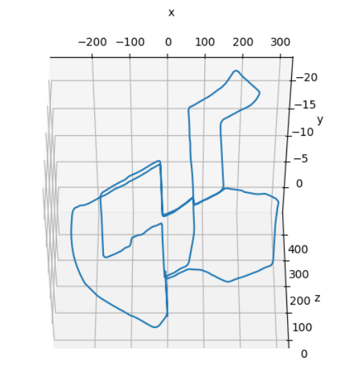
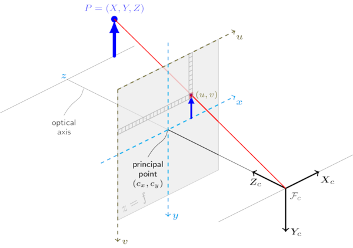

<h1 align = "center">Visual odometry with KITTI dataset</h1>

 Visual Odometry is the tracking the movement of a robotic system with the help of c visual data/ camera data. 

The project works with KITTI dataset, built by *Karlsruhe Institute of Technology and Toyota Technological Institute*, is a very popular dataset used in building and benchmarking Algorithms for Autonomous driving in cars and robotic systems. 

The  data source  different datasets which contains contains a sequence of images(grayscale/ color) or  LIDAR point cloud based on what you choose to download and work with. 

Here in this project we work with grayscale images as  our algorithm tracks the camera by extracting features from images and grayscale imaes are sufficient for this

follow the links to access the data.
 
<a>link1</a> 
<a>link2</a> 
<a>link3</a> 
<a>link4</a>

### Understanding the Sensor setup  used in extracting data

</img>

<i>img: Image illustrating  the camera setup in car</i>

Broadly we can say that the setup has three sets of sensor systems

* **Gray Scale camera (stereo)** -  A pair of cameras that are fixed a  baseline, *b* distance apart that produce a stream of high quility images captures at the rate of 10FPS. 

* **Color camera (Stereo)** - A setup of a pair of color cameras. This provides  color images, that could  be used  to perform advanced tasks  of the likes semantic segmentation. 

* **LIDAR data** -  Point cloud data from a accurate velodyne lidar scanner mounted on the car.

### **What we are trying to accomplish?**

We want to map the path of the system using visual data as the car moves through a predefined path.We want to just the visual data without any assistance from any position tracking system like GPS and estimate the track like the illustration below. 
 
 

<i>img: Trajectory of the car</i>

 
 

<h3 align = "center"> More about the data</h3>. 

* The data provides ground truth values for all the poses the vehicle assummes through its trajectory.
  
* The pose data is a set of  `projection matrices` - A matrix that describes how much rotation and traslation the  camera has under gone from with reference to the origin.
 
* The data also provide caliberation that provides that intrinsic  parameters of camera including the focal length of the camera and the  factors to adjust the optical center of the camera to the center of focal plane. 
(This is a very vague description please read the trailing  decription to understand  more). 

### **Some coordinate geometry** 

We use two different sets of coordinate systems - 

* **Global coordinate system**  - A common coordinate system for all the objects in the environment under study. The origin is usully set to some point in the environment that could act as a common reference point for all the objects in the environment.
   
   

$$
\begin{bmatrix}
X_{global} \\
Y_{global} \\
Z_{global}
\end{bmatrix}
$$

<i>global coordinate system</i>

 
 

* **Camera's coordinate system**  - A coordinate system that assumes the cameras center to be the origin and track  other object in the environment from *camera's pov*.

$$
\begin{bmatrix}
X_{camera} \\
Y_{camera} \\
Z_{camera}
\end{bmatrix}

$$

<i>camera's coordinate system</i>

**Translating between the  coordinates**

You use `[R|t]` matrix to translate from the  camera's coordinates to the global ones and its inverse to go back. 
 
 

$$
\begin{bmatrix}
X_{global} \\
Y_{global} \\
Z_{global}
\end{bmatrix}

= \begin{bmatrix}
R|t
\end{bmatrix}

\begin{bmatrix}
X_{camera} \\
Y_{camera} \\
Z_{camera}
\end{bmatrix} 
$$

<i>Translating between the coordinates frames</i>

 
 

### **from 3D to 2D**

Capturing an image is the process of mapping of the 3D objects in the camera's field of view on a flat plane.

So we  describe the process of capturing an image as mapping the objects that are at Z distance from the camera on to a plane that is focal distance away from the camera. This plane is called the `focal plane` of the camera. 

</img>

<i> img: Forming image on  the focal plane</i>

$$
\begin{bmatrix}
u \\
v \\
\end{bmatrix} = 

k 

\begin{bmatrix}
X_{camera} \\
Y_{camera} \\
Z_{camera}
\end{bmatrix}
$$
 
 

where k, *the intrinsic matrix* is
 
 

$$
k = 
\begin{bmatrix}
f_x & 0 &  c_x\\
0 & f_y & c_y \\
0 & 0 & 1
\end{bmatrix}
$$

  

